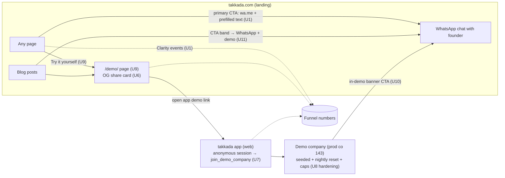

# feat: WhatsApp funnel + live demo overhaul of takkada.com

**Target repos:** this plan spans three repos. Units are labeled; paths are relative to each unit's repo.
- `landing` (this repo, `takkada website/landing`) — most units
- `takkada` (Flutter app; nested checkout at `takkada/takkada` in the workspace) — U7, U10
- `supabase-functions` — U8

## Summary

Phase A converts the site to a WhatsApp-first funnel with measurement and ships the four already-specced trust units (testimonials, safety block, comparison page, video) plus the image/perf and social-card fixes. Phase B exposes the production-live demo company ("Shreeji Distributors (Demo)", already seeded in prod with nightly reset) to web visitors via anonymous instant entry in the app, a `/demo` share page, and a demo-first hero. Phase C re-points the blog machine's CTAs at the same funnel and clears the July audit checklist.

---

## Problem Frame

takkada.com gets ~90 visitors/week and produces ~0 demos; the buyer is a WhatsApp-native distributor owner on a phone, but the site's only conversion path is a calendar link and nothing is measured. Full framing in the origin doc (see Sources & References).

---

## Requirements

Traceability to origin R-IDs (`docs/brainstorms/2026-07-06-takkada-com-10x-overhaul-requirements.md`):

| Origin | Covered by |
|---|---|
| R1 WhatsApp-first CTAs | U1, U11 |
| R2 Testimonial wall | U2 |
| R3 Data-safety/trust section | U2 |
| R4 Dedicated comparison page | U3 |
| R5 Demo video embed | U4 |
| R6 Mobile image/perf | U5 |
| R7 Funnel measurement | U1 (events), U9 (demo events) |
| R8 "Try it yourself" hero | U9 |
| R9 Zero-friction demo entry | U7 |
| R10 Demo walled off / safety layer | U8 (plus existing shipped safety layer) |
| R11 In-demo WhatsApp handoff | U10 |
| R12 Shareable demo link + preview card | U6, U9 |
| R13 Article backlog keeps shipping into the funnel | U11 (CTA routing); production itself deferred to existing content plans |
| R14 Audit action list | U12 |
| R15 New search-intent pages | Deferred to Follow-Up Work (existing blog-batch pipeline + backlog plans) |
| R16 Design/premium pass | U9 (hero + coherence sweep), quality bar applied across U2–U6 |

**Origin actors:** A1 distributor owner (buyer), A2 referrer (customer/partner/CA), A3 founder (operator).
**Origin flows:** F1 referral validation, F2 try-it-yourself, F3 share-forward, F4 cold search arrival.
**Origin acceptance examples:** AE1 (R1), AE2 (R8, R9), AE3 (R10), AE4 (R12), AE5 (R7).

---

## Scope Boundaries

- takkada.ai, paid ads, YouTube/off-site presence, vernacular versions, rebrand — all out (origin).
- No pricing changes: `src/data/schema.test.js` hard-locks the June 2026 rate card (₹4,500/₹6,480/₹8,499). This plan does not touch pricing data.
- No changes to the demo dataset/reset machinery itself — it is shipped and live in prod; this plan only adds entry, hardening, and conversion surfaces around it.
- Partner-page funnel (Partners.jsx PhoneModal flow) stays as-is — partners are a different audience from the distributor buyer.

### Deferred to Follow-Up Work

- In-body calendar links in ~63 blog posts: scripted content sweep as a separate batch PR after U11 establishes the new convention (user-confirmed deferral).
- R15 new search-intent pages and the remaining ~11 backlog article topics: produced via the existing blog-batch swarm pipeline (`docs/plans/2026-06-21-001-content-aeo-seo-20-articles-swarm-plan.md` conventions), with the U11-updated CTA contract.
- `docs/solutions/` bootstrap + `/ce-compound` write-ups for WhatsApp CTA measurement, demo-entry mechanics, and share-card unfurling once shipped.

---

## Context & Research

### Relevant Code and Patterns

- CTA surfaces (all four must move together): `src/data/siteContent.js` `appLinks.bookDemo`; hardcoded `DEMO_URL` in `src/routes/BlogPost.jsx`; per-ICP `ctaPrimary.href` literals (`src/routes/MobileTally.jsx` etc.); ~63 markdown posts (deferred sweep).
- Shared button: `src/components/CTAButton.jsx` (variants primary/secondary/outline/dark). Header/mobile CTA: `src/Layout.jsx`. Phone-capture flow: `src/components/PhoneModal.jsx` + `src/lib/demoBooking.js` (Supabase Edge Fn + Discord).
- **Popup-blocker lock**: `PhoneModal.jsx` opens the calendar `window.open` synchronously before any `await`; `src/components/PhoneModal.test.jsx` asserts the ordering. All new outbound CTAs must follow this (plain anchors preferred).
- Clone pattern: `src/routes/TallyOnMobile.jsx` = `<Home seo={…}/>`; `Home` takes a `seo` prop. New pages need dual registration: `src/data/siteMetadata.js` (routeMetadata → sitemap) AND `ELEMENT_FOR_PATH` in `src/routes/index.jsx` (build throws otherwise).
- Comparison matrix: `src/components/ComparisonSection.jsx` renders from `comparisonSection` in siteContent.js (columns Takkada/Biz Analyst/Livekeeping, 9 boolean rows, dated fairness disclaimer).
- Testimonials: `src/components/TestimonialCard.jsx`; `testimonials.map()` in Home; testimonials also emit schema.org Review nodes (`src/data/schema.js`), count asserted in `src/data/schema.test.js`.
- OG/social: `src/components/Seo.jsx`; `DEFAULT_OG_IMAGE = '/assets/screenshots/takkada-logo.png'` in `src/data/schema.js` — every non-blog page's card is the logo today.
- Analytics: Microsoft Clarity inline snippet in `index.html` (project `x3qmzef9tl`); zero custom events today.
- **Image preloads are injected by vite-react-ssg itself** (renderPreloadLinks over the SSR manifest) — not authored in the repo. Suppression requires the SSG's post-render hook (`onPageRendered`) or restructuring the asset graph. 22 PNGs in `public/assets/screenshots/` (up to 1.6 MB), no WebP/AVIF, no `loading` attrs on Home imgs.
- Tests that hard-lock copy: `src/routes/__tests__/tally-on-mobile.test.jsx` (verbatim hero string "Get paid without chasing" + pricing line), `src/data/schema.test.js` (prices, Review↔testimonial coupling), `src/Layout.test.jsx`, `src/routes/__tests__/landing-schema.test.jsx` (FAQ/breadcrumb).
- App side (repo `takkada`): demo entry today is post-OTP "Explore a demo company" button (`lib/screens/setup_on_pc_screen.dart`); `BusinessService.joinDemoCompany()` calls RPC `join_demo_company`; `Business.isDemo`; license-gate exemptions for demo already shipped. No anonymous auth anywhere yet.
- Backend (verified live on prod 2026-07-06): demo company id 143 "Shreeji Distributors (Demo)" seeded (48 ledgers, 67 sales invoices), `join_demo_company()` + `seed_demo_company_dataset()` deployed, `reset-demo-company` pg_cron live. Safety layer shipped: per-user message cap (`try_consume_demo_message`), WhatsApp send-guard redirect (`_shared/demo_send_guard.ts`), reminder-scheduler exclusion.

### Institutional Learnings

- `docs/plans/2026-06-21-003-feat-sxo-trust-comparison-followups-plan.md`: U1 testimonials / U2 trust block / U3 comparison page / U4 video — fully specced, never built; absorbed here as U2/U3/U4 (this plan). Its Q1 (count honesty) resolved by origin decision; Q2 (video form) and Q3 (real quotes) remain operator-gated.
- Never edit assets in `dist/` — build reverts them; source is `public/` (2026-06-18 revamp plan incident).
- One font family: Plus Jakarta Sans (CLAUDE.md §7); the Fraunces `<link>` in `index.html` is vestigial.
- Comparison-page cannibalization guardrail (`docs/seo/competitor-pages-audit-2026-06-21.md`): target the matrix/comparison intent; cross-link, don't duplicate, the five existing competitor "alternative" posts; prefer pricing-agnostic framing.
- Cloudflare injects the robots.txt AI-crawler block (dashboard-managed, not repo); verify with `node scripts/checkCrawlerAccess.mjs`.
- Blog image generation needs a Pillow venv (PEP-668): `python3 -m venv /tmp/blogimg-venv && …` — same recipe applies to OG-card generation.
- Deploy: PR-protected `main`, Cloudflare deploys on merge; `npm run build` includes `lint:content` and sitemap generation. Repo path contains a space — quote it in shell commands.
- App repo rule: `flutter analyze` after every dart edit; UI changes need a `flutter run -d chrome` eyeball before push; push `stage` only. Backend rule: migrations as files only, push `stage` only.

### External References

- None needed — all mechanics have local patterns; wa.me click-to-chat and Clarity custom events are standard platform features.

---

## Key Technical Decisions

- **Anonymous instant demo entry (Supabase anonymous sign-in) is the primary path** (user-confirmed): visitor taps → anonymous session → `join_demo_company()` → home. No phone capture at entry; lead capture happens via the in-demo WhatsApp CTA. Phone-OTP entry remains the documented fallback only if anonymous sign-in proves infeasible during implementation.
- **The shareable demo link is `takkada.com/demo/` (a landing page), not a raw app URL**: the site page owns the WhatsApp unfurl card, explains what the demo is, and buttons into the app. Keeps attribution and copy on our domain.
- **WhatsApp CTAs are plain `wa.me` anchors with page-specific pre-filled text, pointing at the founder's WhatsApp Business number** (user-confirmed; number is operator-supplied config). Measurement counts CTA taps via Clarity custom events — no WhatsApp API integration for inbound.
- **Measurement stays on Clarity** (custom events + dashboard funnels); no new analytics dependency. The existing Supabase demo-booking capture remains for the phone-modal path.
- **Preload fix via the SSG's post-render hook**: the blanket image preloads are library-injected; post-process the rendered HTML to keep only the above-the-fold hero preload. Do not re-enable the disabled GitHub Pages workflow; do not edit `dist/` by hand.
- **Absorb, don't redesign, the SXO follow-up specs** for testimonials/trust/comparison/video — decisions in that plan carry forward (single data source, thin-route clone pattern, fairness disclaimer, click-to-play video with CLS guard).
- **One OG-card system serves both** the audit's og:image finding and the WhatsApp share card (1200×630 branded cards; site-wide default + per-page overrides for `/demo/` and the comparison page).
- **Hero changes propagate to `/tally-on-mobile` by design** (verbatim clone); its test strings update in the same PR (U9).

---

## Open Questions

### Resolved During Planning

- Is the demo company production-ready? **Yes — verified live on prod 2026-07-06**: seeded company 143, join fn, seed fn, nightly reset cron all present. No backend rollout needed before Phase B.
- Does the app support anonymous entry today? **No** — grep confirms no anonymous auth; entry is post-OTP. U7 is genuinely new app work.
- What counts as a "demo booked"? WhatsApp conversation started with intent OR calendar booking (origin decision).

### Deferred to Implementation

- Video hosting form (self-hosted MP4 vs YouTube unlisted): depends on the asset the founder supplies; the embed component supports either.
- Exact pre-filled WhatsApp copy per page: written at implementation under CLAUDE.md §5 voice rules.
- Supabase anonymous sign-in dashboard settings (enable toggle, rate limits, captcha option): configure on stage first, then prod; exact settings depend on what the dashboard exposes.
- WebP conversion tooling and quality levels; whether AVIF is worth a second variant.
- `/become-a-partner/` dedupe mechanism: sitemap exclusion vs Cloudflare 301 — pick whichever is cleanest at implementation.

---

## High-Level Technical Design

> *This illustrates the intended approach and is directional guidance for review, not implementation specification.*

Unit dependencies: U1 → U3, U9, U11 · U6 → U9 · U8 → U7 → U9 · U10 independent app work after U7 · U2, U4, U5, U12, U13 independent.

---

## Implementation Units

### U1. WhatsApp-first CTA system + funnel events *(landing)*

**Goal:** Every page's primary action becomes a WhatsApp chat with context-aware pre-filled text; CTA taps and calendar opens become measurable.

**Requirements:** R1, R7 (AE1, AE5; F1, F4)

**Dependencies:** Operator supplies the WhatsApp Business number.

**Files:**
- Create: `src/lib/whatsapp.js` (link builder: number + per-context message), `src/lib/track.js` (Clarity custom-event helper, safe no-op when Clarity absent), `src/components/WhatsAppCTA.jsx`
- Modify: `src/data/siteContent.js` (WhatsApp config in `appLinks`), `src/Layout.jsx`, `src/routes/Home.jsx` (hero/feature/pricing/final CTAs), `src/components/ICPTemplate.jsx` + the four ICP route files, `src/components/PhoneModal.jsx` (fire `calendar_open` event; calendar flow stays as secondary path)
- Test: `src/components/__tests__/whatsapp-cta.test.jsx`, extend `src/components/PhoneModal.test.jsx`

**Approach:**
- WhatsApp CTAs are plain anchors (`wa.me/<number>?text=…`) — no `window.open` after awaits (popup-blocker lesson). Tracking fires fire-and-forget on click, never awaited before navigation.
- Each surface passes a context key (page/section) that selects the pre-filled message, so the founder can tell what the visitor was reading.
- Calendar booking demoted to secondary everywhere (visible, not primary). Fix the dead `/#pricing-strip` anchor on ICP `ctaSecondary` while touching those files.

**Patterns to follow:** `CTAButton.jsx` variants; `PhoneModal.jsx` synchronous-open ordering and its test.

**Test scenarios:**
- Happy path: WhatsAppCTA renders an anchor whose href contains the configured number and URL-encoded context message. Covers AE1.
- Happy path: clicking fires the Clarity event with the context key; navigation href is present regardless of tracking outcome.
- Edge case: Clarity script absent → track helper no-ops without throwing.
- Edge case: missing/unset WhatsApp number → component renders nothing (or falls back to calendar) rather than a broken link.
- Integration: PhoneModal still opens the calendar synchronously before the booking request settles (existing lock stays green) and now also emits `calendar_open`.

**Verification:** On a phone, tapping the hero CTA opens WhatsApp with the right pre-filled text; Clarity dashboard shows the custom events; all existing tests green.

---

### U2. Testimonial wall + data-safety trust section *(landing)*

**Goal:** Replace the single testimonial with a 3–5 quote wall and add a section that directly answers "will it break my Tally / is my data safe / is this legit".

**Requirements:** R2, R3 (F1)

**Dependencies:** Founder supplies 3–5 real named quotes (build with clearly-marked placeholders; launch gated).

**Files:**
- Modify: `src/data/siteContent.js` (testimonials array; new trust-section content), `src/routes/Home.jsx` (wall layout + trust section), `src/styles.css`
- Test: extend `src/data/schema.test.js` (Review count follows testimonials), new render assertions in a Home-section test file

**Approach:**
- Absorb the SXO plan's U1/U2 specs: `TestimonialCard` already maps N items — this is data + CSS; trust block reuses the `FeatureCard`/icon vocabulary, names specific behaviors (read-only sync, data stays in your Tally, real app-store listings), links to `/blog/is-it-safe-to-connect-app-to-tally/`.
- Voice rules apply: no "bank-grade security", no invented quotes, tabular-nums on any ₹ figure.

**Test scenarios:**
- Happy path: N testimonials in data → N cards rendered and N schema.org Review nodes emitted.
- Happy path: trust section renders its claims and the internal link to the safety article.
- Edge case: placeholder testimonials carry a marker that a test rejects for production builds (guards launching with fake quotes).

**Verification:** Wall and trust section render on mobile widths; schema tests green; copy passes the CLAUDE.md §12 banned-token grep.

---

### U3. Dedicated comparison page *(landing)*

**Goal:** Promote the home comparison matrix to an indexable route targeting the comparison/"best Tally mobile app" intent.

**Requirements:** R4 (F4)

**Dependencies:** U1 (WhatsApp CTA band on the page).

**Files:**
- Create: `src/routes/TallyMobileComparison.jsx` (slug `/tally-mobile-app-comparison/`)
- Modify: `src/data/siteMetadata.js` + `src/routes/index.jsx` (dual registration), `src/data/siteContent.js` (enrich `comparisonSection` rows: zero-MDR UPI collection, two-way Tally write-back)
- Test: `src/routes/__tests__/tally-mobile-comparison.test.jsx`

**Approach:**
- Single data source stays `comparisonSection` — the page and the home section render the same matrix (no fork). Keep the dated fairness disclaimer; pricing-agnostic framing per the cannibalization audit; cross-link the five existing competitor "alternative" posts; WhatsApp-first CTA band.

**Patterns to follow:** `TallyOnMobile.jsx` thin-route registration; `landing-schema.test.jsx` breadcrumb conventions.

**Test scenarios:**
- Happy path: route renders the matrix with all three columns and enriched rows; title/description within Seo length warnings.
- Integration: page registers in both routeMetadata and ELEMENT_FOR_PATH (build-time guard passes; sitemap includes the slug).
- Happy path: breadcrumb JSON-LD resolves to a registered path.

**Verification:** Page live in dist build with correct canonical/OG; internal links from the five alternative posts added or queued.

---

### U4. Demo video embed *(landing)*

**Goal:** Embed the founder's demo video at a decision-relevant point on home.

**Requirements:** R5

**Dependencies:** Founder supplies the video (form decides MP4 vs YouTube at implementation).

**Files:**
- Create: `src/components/VideoEmbed.jsx`
- Modify: `src/routes/Home.jsx`, `src/data/siteContent.js`
- Test: `src/components/__tests__/video-embed.test.jsx`

**Approach:** Absorb the SXO U4 spec: click-to-play with poster, no autoplay, `preload="none"`/lazy iframe, fixed aspect-ratio box (CLS guard), aria-labelled play control, motion opt-in reason documented in the file header.

**Test scenarios:**
- Happy path: renders poster + play control; no video/iframe network request until click.
- Happy path: after click, the player mounts (MP4 `<video>` or lazy iframe, per final form).
- Edge case: missing video config → section renders nothing (site never shows an empty frame).

**Verification:** No CLS from the embed; page weight unchanged before interaction.

---

### U5. Image + performance overhaul *(landing)*

**Goal:** The site loads fast on cheap Android over slow data: modern image formats, sane preloads, lazy loading.

**Requirements:** R6

**Dependencies:** None.

**Files:**
- Modify: `public/assets/screenshots/` (WebP variants; sources stay in `public/`, never `dist/`), `src/routes/Home.jsx` (`loading`/`fetchpriority`/`decoding` attrs), `vite.config.js` (SSG post-render processing of injected preloads), `index.html` (drop vestigial Fraunces font link)
- Test: build-verification script or test asserting dist HTML contains at most the hero image preload

**Approach:**
- Convert the heavyweight PNGs to WebP (`<picture>` fallback or direct swap — decide by browser-support bar at implementation).
- Suppress the library-injected blanket preloads via the SSG's post-render hook; keep exactly one preload for the above-the-fold hero image. This is library behavior, not repo config — the hook is the only clean seam.
- Below-the-fold images get `loading="lazy"`; hero gets `fetchpriority="high"` (mirror the BlogPost.jsx convention).

**Test scenarios:**
- Integration: `npm run build` output for `/` contains ≤1 image preload and it is the hero.
- Happy path: non-hero Home images carry `loading="lazy"`.
- Edge case: blog pages keep their existing eager/lazy split (no regression from the post-render processing).

**Verification:** PageSpeed/Lighthouse mobile LCP measurably improves vs the audit baseline (~4.2 MB of preloaded PNGs); visual walk of home on a throttled connection shows the hero painting first.

---

### U6. Social/OG card system *(landing)*

**Goal:** Real 1200×630 branded social cards replace the logo-as-og:image, and give the demo link a rich WhatsApp preview.

**Requirements:** R12 (AE4 foundation), audit item

**Dependencies:** None (U9 consumes the demo card).

**Files:**
- Create: `public/assets/og/` cards + a generation script alongside `scripts/generate-blog-images.py` (Pillow venv recipe)
- Modify: `src/data/schema.js` (`DEFAULT_OG_IMAGE`), per-page `ogImage` overrides where warranted (home, comparison, `/demo/`)
- Test: extend `src/components`/schema tests asserting og:image is no longer the logo and per-page overrides emit

**Test scenarios:**
- Happy path: default og:image points at the new branded card (absolute URL).
- Happy path: `/demo/` and comparison pages emit their specific cards.
- Edge case: blog posts keep their per-post heroImage override (unchanged).

**Verification:** Sharing takkada.com and takkada.com/demo/ in WhatsApp shows a branded preview card (manual check on a real device).

---

### U7. Anonymous instant demo entry *(takkada app)*

**Goal:** A web visitor reaches the populated demo company in under 60 seconds with no signup.

**Requirements:** R8, R9 (AE2; F2, F3)

**Dependencies:** U8 (hardening lands first); Supabase dashboard: enable anonymous sign-ins (stage, then prod — operator/agent config step).

**Files (repo `takkada`):**
- Modify: routing/entry (`lib/screens/splash_screen.dart` or router-level deep-link handling), `lib/services/business_service.dart`, onboarding-flow helpers
- Test: unit tests for the new entry helpers; widget test for the entry flow

**Approach:**
- A dedicated web entry link (e.g., a `demo` route/query the app recognizes) triggers: anonymous sign-in → `joinDemoCompany()` → land on home in the demo, reusing the shipped license exemptions and `resolveActiveBusinessId` step-aside logic.
- Feature-flagged so it can be disabled without a release; entry link exercised from stage first.
- An anonymous session that later signs up properly follows the normal OTP path (the demo "step-aside" logic already prefers a real company).
- Fallback documented in-plan: if anonymous sign-in is blocked by platform constraints, the entry link routes to phone-OTP followed by auto-join (the existing button's path) — accepted friction, decision revisited with the founder.

**Execution note:** UI change — `flutter run -d chrome` eyeball of the full web entry before push (repo rule); push `stage` only.

**Test scenarios:**
- Happy path: entry link with flag on → anonymous session created → demo company joined and selected → home renders demo data. Covers AE2.
- Edge case: entry link with flag off → normal signup flow, no anonymous session.
- Edge case: returning visitor with an existing anonymous session re-enters the demo without creating a second user.
- Error path: `join_demo_company` failure → visitor lands on the normal signup screen with a readable message, not a blank screen.
- Integration: anonymous user's license gate exemption holds (no "License Expired" wall).

**Verification:** On stage web, a cold incognito visit through the entry link reaches populated demo reports in <60s; `flutter analyze` clean; tests green; founder eyeballs before push.

---

### U8. Demo hardening for anonymous web visitors *(supabase-functions)*

**Goal:** Web-originated anonymous users are safe: they can only ever touch the demo company, can't spam, and don't accumulate forever.

**Requirements:** R10 (AE3)

**Dependencies:** None (precedes U7 exposure).

**Files (repo `supabase-functions`):**
- Create: migration(s) under `supabase/migrations/` (anonymous-user guards + cleanup), SQL regression tests alongside the existing `demo_seed_populates_all_reports.sql` / `reset_demo_company_restore.sql`
- Modify: extend `reset_demo_company()` (or a sibling scheduled job) to prune stale anonymous demo memberships/users

**Approach:**
- Verify `join_demo_company()` behaves correctly for anonymous (`is_anonymous`) JWTs; constrain anonymous users to demo-company membership only (they must not be able to create or join real companies while anonymous).
- Existing per-user message cap and WhatsApp send-guard already cover messaging; add a company-level daily ceiling if the per-user cap alone is abusable by mass anonymous sessions.
- Cleanup: nightly prune of anonymous users/memberships older than a small number of days, riding the existing reset cron pattern.
- Ship as migration files to `stage` (never direct MCP applies); expect the phantom-version reconciliation pattern if any prod hotfix intervenes.

**Test scenarios:**
- Happy path: anonymous JWT can `join_demo_company` and read demo data.
- Error path: anonymous JWT cannot create a company or join a non-demo company. Covers AE3.
- Happy path: message cap holds for an anonymous user exactly as for OTP users.
- Integration: cleanup prunes an aged anonymous membership; a fresh entry after reset still works. Covers AE3 (clean state next day).
- Edge case: reset + prune running together leaves the demo company seeded and joinable.

**Verification:** SQL tests pass on stage; a manual stage walk confirms an anonymous session sees only demo data (RLS check across the member-scoped tables).

---

### U9. `/demo/` share page + demo-first hero + design pass *(landing)*

**Goal:** The site's hero experience becomes "try it yourself"; a stable shareable page gives referrers a link that unfurls beautifully and lands recipients in the demo.

**Requirements:** R8, R12, R16 (AE2, AE4; F2, F3)

**Dependencies:** U1 (CTA/tracking plumbing), U6 (demo OG card), U7 (working app entry link).

**Files:**
- Create: `src/routes/TryDemo.jsx` (slug `/demo/`)
- Modify: `src/data/siteMetadata.js` + `src/routes/index.jsx` (dual registration), `src/routes/Home.jsx` (hero: primary "Try it yourself" → app entry link; WhatsApp secondary), `src/styles.css`
- Test: `src/routes/__tests__/try-demo.test.jsx`; update `src/routes/__tests__/tally-on-mobile.test.jsx` verbatim strings in the same change

**Approach:**
- `/demo/` explains what the visitor will see (real distributor books, resets nightly), sets expectations, and buttons into the app entry link with tracking (`demo_try_click`); WhatsApp CTA as the secondary action.
- Hero rework applies the premium/design bar (R16): mobile-first, conventional patterns, no vanity claims; run a coherence sweep of secondary pages so tokens/type stay consistent (2026-06-18 plan lesson). Load the frontend-design skill at implementation.
- `/tally-on-mobile` stays a verbatim clone and inherits the new hero automatically; its locked test strings update in the same PR.

**Execution note:** UI change — run the site locally and let the founder eyeball the new hero + `/demo/` before merge (repo rule analog).

**Test scenarios:**
- Happy path: `/demo/` renders, registered in sitemap + router, emits its OG card and canonical. Covers AE4 (unfurl foundation).
- Happy path: hero primary CTA points at the app entry link and fires `demo_try_click`; secondary is WhatsApp. Covers AE2 (site side).
- Integration: tally-on-mobile clone test passes with the updated verbatim strings.
- Edge case: with the demo feature flag off (U7), `/demo/` falls back to WhatsApp/calendar CTAs rather than a dead link.

**Verification:** Forwarding takkada.com/demo/ in WhatsApp shows the branded card; tapping it on a phone lands in the populated demo (stage first, then prod).

---

### U10. In-demo conversion banner *(takkada app)*

**Goal:** Demo visitors always see where they are and how to get this for their own business.

**Requirements:** R11 (AE3 context; F2)

**Dependencies:** U7.

**Files (repo `takkada`):**
- Create: a demo-mode banner widget
- Modify: home screen scaffolding to show it when `Business.isDemo`
- Test: widget tests

**Approach:** Persistent, unobtrusive banner: "You're exploring a demo company" + primary "Set this up for my business" (WhatsApp deep link with a demo-context pre-filled message) + an exit/sign-up affordance. Conventional patterns only (non-technical users).

**Test scenarios:**
- Happy path: banner renders when the active business is the demo; absent otherwise.
- Happy path: CTA launches the WhatsApp link with demo context.
- Edge case: banner does not cover critical UI on small screens (golden/layout test as feasible).

**Verification:** `flutter analyze` clean; `flutter run -d chrome` eyeball; push `stage`.

---

### U11. Blog CTA migration *(landing)*

**Goal:** All ~118 articles route readers into the WhatsApp/demo funnel via the shared CTA band and the authoring contract.

**Requirements:** R1, R13 (F4)

**Dependencies:** U1.

**Files:**
- Modify: `src/routes/BlogPost.jsx` (CTA band → WhatsApp primary + "Try the demo" secondary; remove the hardcoded `DEMO_URL` in favor of the shared config), `.claude/commands/blog-batch.md` + blog-batch skill contract (closing-CTA convention), `src/routes/BlogIndex.jsx` if it carries CTAs
- Test: extend blog route tests for the new band

**Approach:** The band is one component — changing it moves every post at once. The authoring contract's closing-line convention changes so future articles are born WhatsApp-first. The ~63 in-body calendar links are explicitly deferred (Scope Boundaries).

**Test scenarios:**
- Happy path: a rendered post shows the WhatsApp-primary band with tracking context `blog`.
- Integration: band link uses the shared config (no hardcoded calendar URL remains in BlogPost.jsx).
- Edge case: posts still render when WhatsApp config is absent (fallback to calendar).

**Verification:** Spot-check several live posts post-deploy; `lint:content` and build green.

---

### U12. Audit + GEO cleanup batch *(landing + Cloudflare ops)*

**Goal:** Clear the July 2026 audit's open items so the traffic engine isn't handicapped.

**Requirements:** R14

**Dependencies:** None.

**Files:**
- Modify: `content/blog/cheque-bounce-recovery-distributors.md` (meta description), the five over-long titles + Blog index title, sitemap handling for `/become-a-partner/`
- Create: `public/llms.txt` (product summary + highest-value page links)
- Ops (operator/dashboard, not repo): disable Cloudflare "Block AI bots" managed rule, add HSTS/security headers via Cloudflare; verify with `node scripts/checkCrawlerAccess.mjs`

**Approach:** Repo items are mechanical edits; dashboard items are explicitly flagged operator actions with the verification script as the done-check. Don't mark R14 complete until `checkCrawlerAccess.mjs` passes against production.

**Test scenarios:**
- Happy path: build emits sitemap without the partner alias (or the 301 is in place); llms.txt served from dist.
- Integration: `checkCrawlerAccess.mjs` reports AI crawlers allowed (post dashboard change).
- Test expectation for title/description edits: Seo.jsx length warnings silent in test output.

**Verification:** Re-run the audit checks that flagged these items; all pass against the live site.

---

### U13. Docs/guardrail sync *(landing)*

**Goal:** The repo's own rules stop contradicting the shipped reality so future passes don't "fix" correct copy.

**Requirements:** Supports R2/R16 durability.

**Dependencies:** None.

**Files:**
- Modify: `CLAUDE.md` — §5 record the numbers resolution ("100+ businesses / ₹17Cr+ are platform-wide figures, founder-confirmed 2026-07-06; ~20 = paying customers, does not constrain site copy"); §3 remove the stale View Only ₹2,700 plan; §8 correct deploy description to Cloudflare-on-merge

**Test scenarios:** Test expectation: none — documentation-only unit.

**Verification:** A fresh craft-review pass of the site copy no longer flags the 100+/₹17Cr stats.

---

## System-Wide Impact

- **Interaction graph:** the hero and CTA changes flow into `/tally-on-mobile` (verbatim clone) and all four ICP pages via `ICPTemplate`; the blog band change touches every rendered post; schema Review nodes track the testimonials array.
- **Error propagation:** tracking must never block navigation (fire-and-forget); demo entry failures must land on the normal signup screen, not dead-end.
- **State lifecycle risks:** anonymous users accumulate — U8's prune is the guard; nightly demo reset must coexist with active anonymous sessions (a visitor mid-session at 02:30 IST sees data change — accepted, demo only).
- **API surface parity:** the app's demo entry must behave identically on stage and prod; the send-guard/message-cap layer already runs in both.
- **Integration coverage:** the site→app handoff (U9→U7) crosses repos and can only be proven by a real device walk on stage — scripted tests cover each side separately.
- **Unchanged invariants:** pricing data and its hard-locked tests; the partner funnel; the demo dataset/reset machinery; blog auto-discovery and sitemap generation mechanics; the PR-protected `main` deploy path in all three repos (landing → `main` via PR; takkada + supabase-functions → `stage` only).

---

## Risk Analysis & Mitigation

| Risk | Likelihood | Impact | Mitigation |
|------|-----------|--------|------------|
| Anonymous demo abused (mass sessions, message spam) | Med | Med | U8 before U7; existing per-user cap + send-guard redirect; company-level ceiling; nightly prune; feature flag kills entry instantly |
| Demo mistaken for the visitor's real data | Med | Med | U10 persistent banner + `/demo/` expectation-setting copy |
| WhatsApp volume lands on one human (founder) unanswered | Med | High | Calendar stays as visible secondary; pre-filled context makes triage fast; volume is the success condition — revisit staffing when it hurts |
| Preload suppression regresses LCP or breaks pages | Low | High | Keep hero preload; dist-HTML assertion in build; PSI before/after; the hook only rewrites `<link rel="preload" as="image">` lines |
| SSG library update changes the injection internals | Low | Med | Pin `vite-react-ssg`; the dist assertion fails loudly if injection returns |
| Verbatim-clone and schema tests churn on copy changes | High | Low | Update locked strings in the same PR as the copy change (U9, U2) |
| Operator assets (quotes, video, WhatsApp number) delayed | Med | Med | Placeholder-gated builds; launch checklist tracks the three assets; nothing else blocks on them |
| Anonymous sign-in infeasible on Flutter web / dashboard constraints | Low | High | Documented fallback: OTP-then-auto-join path (existing machinery); decision surfaced to founder before accepting the friction |

---

## Success Metrics

From origin: within ~3 months — ≥1 demo/day from the site (WhatsApp conversation with intent or calendar booking), 1,000 visitors/week, and the visitor → CTA → conversation/demo funnel readable weekly from Clarity without asking anyone (AE5).

---

## Phased Delivery

### Phase A — Funnel + trust (ship in ~2 weeks): U1, U2, U3, U4, U5, U6
Lands entirely in the landing repo; each unit is independently PR-able to `main`.

### Phase B — Live demo centerpiece: U8 → U7 → U9, U10
Backend hardening first, then app entry (stage-verified), then the site's demo-first hero and share page flip on.

### Phase C — Traffic routing + cleanup: U11, U12, U13
Can interleave with Phase B; U11 waits only on U1.

---

## Documentation / Operational Notes

- Operator launch checklist: WhatsApp Business number → U1 config; 3–5 named quotes → U2; demo video → U4; Cloudflare dashboard actions → U12; Supabase anonymous sign-in toggle (stage, then prod) → U7.
- Clarity funnels are dashboard-configured — set up the visitor → `whatsapp_cta_click` / `demo_try_click` funnel once U1 deploys, and record the setup in `docs/ops/`.
- After Phase B ships, write the `/ce-compound` learnings (demo entry, share-card unfurl, CTA measurement) — this repo has no `docs/solutions/` yet.

---

## Sources & References

- **Origin document:** `docs/brainstorms/2026-07-06-takkada-com-10x-overhaul-requirements.md`
- Absorbed spec: `docs/plans/2026-06-21-003-feat-sxo-trust-comparison-followups-plan.md`
- Audit: `takkada.com-audit/ACTION-PLAN.md` + `FULL-AUDIT-REPORT.md` (workspace root, outside this repo)
- Comparison guardrail: `docs/seo/competitor-pages-audit-2026-06-21.md`
- Content pipeline: `docs/plans/2026-06-21-001-content-aeo-seo-20-articles-swarm-plan.md`
- Related commits: `eddd7ad` (synchronous calendar open), `6e65f93` (View Only removal), `8ba7a3f` (₹8,499 price)
- Demo machinery (cross-repo): supabase-functions demo migrations + `_shared/demo_send_guard.ts`; takkada `feat/demo-company-landing` work (shipped to stage; verified live in prod 2026-07-06)
